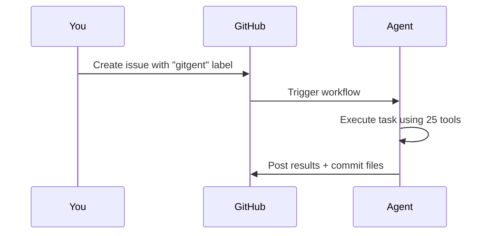

  

  <h1>Gitgent</h1>
  
<strong>Your AI agent, right inside GitHub.</strong> Create an issue. Get results. Artifacts committed automatically.

  

    
    
    = 22" />
  

  

    <a href="#get-started">Get Started</a> · 
    <a href="#what-can-it-do">What Can It Do?</a> · 
    <a href="#how-it-works">How It Works</a> · 
    <a href="#choose-your-ai-provider">Providers</a> · 
    <a href="ADVANCED.md">Advanced Guide</a>
  

---

## Get Started

1. **Use this template** — Click the green **Use this template** button above → **Create a new repository** → set visibility to **Private**.
2. **Add your API key** — In your new repo, go to **Settings → Secrets → Actions** → add `OPENROUTER_API_KEY` ([get one here](https://openrouter.ai/keys)).
3. **Create an issue** — Pick any issue template. The `gitgent` label triggers the agent automatically.

That's it. The agent picks up the issue, executes the task, posts results as comments, and commits output files to your repo.

> **Always create a private repo.** The agent posts results on issues and commits files — a public repo would expose your data. Use **"Use this template"** (not Fork) so you can set it to Private.

---

## What Can It Do?

Pick an issue template and the agent handles the rest:

| Template | What It Does |
|----------|-------------|
| 🤖 **Agent Task** | General-purpose task — ask it anything |
| 📚 **Research** | Deep web research with cited sources |
| 📈 **Data Analysis** | Analyze data, generate reports and charts |
| 📊 **Marketing** | Competitor analysis and market research |
| ✍️ **Content Writing** | Articles, newsletters, documentation |
| 📄 **Document Generation** | Excel, Word, and PowerPoint files |
| 🔎 **Code Review** | Security, quality, and performance analysis |
| ⚙️ **DevOps** | Infrastructure, CI/CD, and automation scripts |
| 🔍 **Job Search** | Job board parsing and tracking |
| 🔄 **Scheduled Task** | Recurring tasks on a daily, weekly, or custom schedule |

Need to follow up? Comment `/gitgent <your request>` on any open issue.

---

## How It Works

- Each run is **isolated** — nothing leaks between tasks
- Output files go to `artifacts/issue-<number>/`
- Labels track progress: `in-progress` → `completed` or `failed`
- The agent can browse the web, generate documents, search the internet, and more

---

## Choose Your AI Provider

Works out of the box with [OpenRouter](https://openrouter.ai) (default). Want to use a different provider? Just change two settings:

| Provider | Set `GITGENT_PROVIDER` to | Add this secret |
|----------|--------------------------|-----------------|
| OpenRouter | `openrouter` (default) | `OPENROUTER_API_KEY` |
| OpenAI | `openai` | `OPENAI_API_KEY` |
| Anthropic | `anthropic` | `ANTHROPIC_API_KEY` |
| Google | `google` | `GEMINI_API_KEY` |
| xAI | `xai` | `XAI_API_KEY` |
| Mistral | `mistral` | `MISTRAL_API_KEY` |
| Groq | `groq` | `GROQ_API_KEY` |

Set `GITGENT_PROVIDER` in **Settings → Variables → Actions** and add the API key in **Settings → Secrets → Actions**.

---

## Questions?

- **Bug reports & feature requests** → [GitHub Discussions](https://github.com/supercheck-io/gitgent/discussions)
- **Developer docs** → [Advanced Guide](ADVANCED.md) · [Contributing](CONTRIBUTING.md) · [Security](SECURITY.md)
- **License** → [MIT](LICENSE) — free and open source, always.

---

  Open source by <a href="https://supercheck.io"><strong>Supercheck</strong></a>

