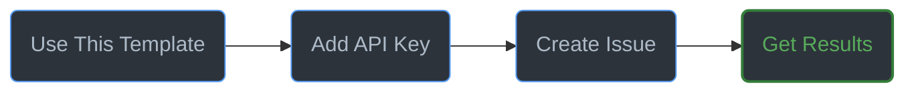
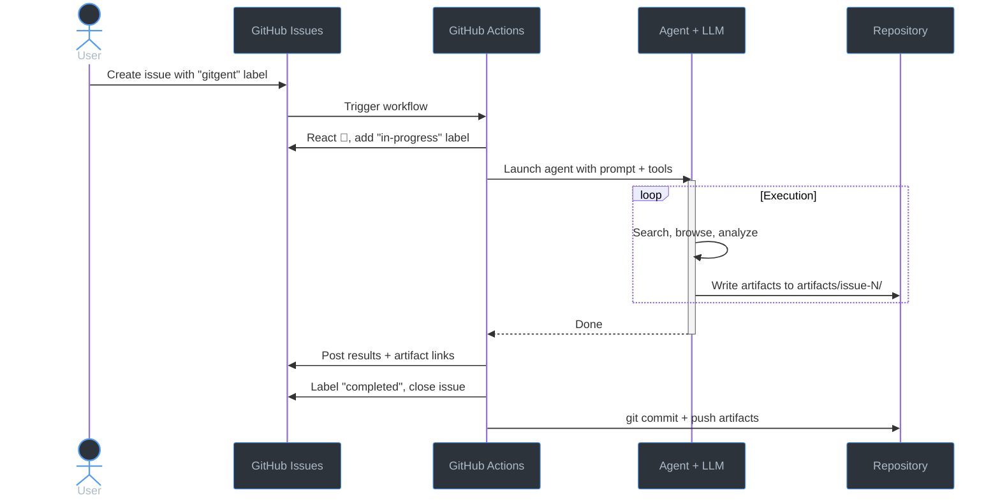

<div align="center">
  
  <h1>Gitgent</h1>
  <p><strong>Your AI agent, right inside GitHub.</strong><br/>Create an issue. Get results. Artifacts committed automatically.</p>

  <p>
    <a href="https://github.com/supercheck-io/gitgent/actions/workflows/ci.yml"></a>
    <a href="https://github.com/supercheck-io/gitgent/blob/main/LICENSE"></a>
    = 22" />
  </p>

  <p>
    <a href="#get-started">Get Started</a> · 
    <a href="#what-can-it-do">What Can It Do?</a> · 
    <a href="#how-it-works">How It Works</a> · 
    <a href="#choose-your-ai-provider">Providers</a> · 
    <a href="#scheduling">Scheduling</a> · 
    <a href="#storage--artifacts">Storage</a> · 
    <a href="#memory">Memory</a> · 
    <a href="#gitgent-vs-openclaw">Compare</a> · 
    <a href="#questions">Questions</a>
  </p>
</div>

---

### Get Started



1. **Use this template** — Click the green **Use this template** button above → **Create a new repository** → set visibility to **Private**.
2. **Add your API key** — In your new repo, go to **Settings → Secrets → Actions** → add `OPENROUTER_API_KEY` ([get one here](https://openrouter.ai/keys)).
3. **Create an issue** — Pick any issue template. The `gitgent` label triggers the agent automatically.

That's it. The agent picks up the issue, executes the task, posts results as comments, and commits output files to your repo.

> **Always create a private repo.** The agent posts results on issues and commits files — a public repo would expose your data. Use **"Use this template"** (not Fork) so you can set it to Private.

---

### What Can It Do?

Pick an issue template and the agent handles the rest:

| Template | What It Does |
|----------|-------------|
| 🤖 **Agent Task** | General-purpose task — ask it anything |
| 📚 **Research** | Deep web research with cited sources |
| 📈 **Data Analysis** | Analyze data, generate reports and charts |
| 📊 **Marketing** | Competitor analysis and market research |
| ✍️ **Content Writing** | Articles, newsletters, documentation |
| 📄 **Document Generation** | Excel, Word, and PowerPoint files |
| 📰 **News Briefing** | News monitoring and recurring digests |
| 🔍 **Job Search** | Job board parsing and tracking |
| 🌐 **Website Builder** | Static sites with unique URLs via GitHub Pages |
| 🔄 **Scheduled Task** | Recurring tasks on a daily, weekly, or custom schedule |

Need to follow up? Comment `/gitgent <your request>` on any open issue.

---

### How It Works



### Key Behaviors

- **Isolated runs** — each issue gets its own `artifacts/issue-<number>/` directory; nothing leaks between tasks.
- **Label tracking** — progress is tracked via labels: `in-progress` → `completed`, `needs-review`, or `failed`.
- **Automatic recovery** — if an artifact-required run produces no files, a single recovery pass is attempted.
- **Memory across runs** — the agent reads past summaries and daily logs before starting, so it can build on prior work and avoid repeating itself. After each run it writes new summaries back to `memory/`.
- **Concurrency control** — runs are serialized per issue via GitHub Actions concurrency groups.

---

### Choose Your AI Provider

Works out of the box with [OpenRouter](https://openrouter.ai) (default). Want to use a different provider? Just change two settings:

| Provider | Set `GITGENT_PROVIDER` to | Add this secret | Default Model |
|----------|--------------------------|-----------------|---------------|
| OpenRouter | `openrouter` (default) | `OPENROUTER_API_KEY` | `minimax/minimax-m2.7` |
| OpenAI | `openai` | `OPENAI_API_KEY` | `gpt-4.1` |
| Anthropic | `anthropic` | `ANTHROPIC_API_KEY` | `claude-sonnet-4-20250514` |
| Google | `google` | `GEMINI_API_KEY` | `gemini-2.5-flash` |
| xAI | `xai` | `XAI_API_KEY` | `grok-3` |
| Mistral | `mistral` | `MISTRAL_API_KEY` | `mistral-large-latest` |
| Groq | `groq` | `GROQ_API_KEY` | `llama-3.3-70b-versatile` |

Set `GITGENT_PROVIDER` in **Settings → Variables → Actions** and add the API key in **Settings → Secrets → Actions**.

<details>
<summary><strong>More providers</strong></summary>

| Provider | `GITGENT_PROVIDER` | Secret |
|----------|-------------------|--------|
| Azure OpenAI | `azure-openai-responses` | `AZURE_OPENAI_API_KEY` |
| Cerebras | `cerebras` | `CEREBRAS_API_KEY` |
| Hugging Face | `huggingface` | `HF_TOKEN` |
| Kimi | `kimi-coding` | `KIMI_API_KEY` |
| MiniMax | `minimax` | `MINIMAX_API_KEY` |
| Vercel AI Gateway | `vercel-ai-gateway` | `AI_GATEWAY_API_KEY` |

When using a non-OpenRouter provider, update your workflow `env:` block to pass the matching secret.

</details>

---

### Scheduling

Add a schedule label to any issue with the `gitgent` label to run it on a recurring basis.

| Label | Frequency |
|-------|-----------|
| `schedule:hourly` | Every hour |
| `schedule:daily` | Daily at 9 AM UTC |
| `schedule:weekly` | Mondays at 9 AM UTC |
| `schedule:custom` | Custom cron — add `cron: 0 14 * * 1-5` to the issue body |

A scheduler workflow runs every hour, scans open issues for schedule labels, and triggers the agent automatically. Keep the issue **open** to continue the schedule.

> **GitHub Actions minutes** — Private repos get **2,000 free minutes/month** (Free plan). Run duration varies by task — a simple research query may finish in 1–2 minutes while complex document generation can use the full 30-minute timeout. Monitor usage in **Settings → Billing → Actions** and adjust schedules accordingly. [Pricing details](https://docs.github.com/en/billing/managing-billing-for-your-products/managing-billing-for-github-actions/about-billing-for-github-actions).

---

### Environment Variables

| Variable | Default | Description |
|----------|---------|-------------|
| `GITGENT_PROVIDER` | `openrouter` | LLM provider id |
| `GITGENT_MODEL` | `minimax/minimax-m2.7` | Model id (provider-specific) |
| `MAX_RUNTIME_MINUTES` | `30` | Execution timeout in minutes |

Set these as **repository variables** via **Settings → Variables → Actions**.

---

### Storage & Artifacts

Every run produces files — research reports, spreadsheets, presentations, websites, CSV data — committed directly to your repo under `artifacts/issue-<number>/`. A few things to know:

- **File types** — the agent can generate Markdown, CSV, Excel (`.xlsx`), Word (`.docx`), PowerPoint (`.pptx`), HTML, and more. All files are committed to your repo with full git history.
- **Size cap** — individual artifact files are limited to **25 MB**. Most generated reports are well under 1 MB.
- **Repo growth** — artifacts accumulate over time. If your repo grows large, you can delete old `artifacts/issue-*/` directories and force-push, or use `git filter-repo` to clean history.
- **GitHub Pages** — use the 🌐 Website Builder template to generate static sites. Each task gets its own URL under `docs/issue-<number>/`, with an auto-generated landing page at the root linking to all sub-sites.

### Memory

The agent maintains memory in `memory/` so it can learn from previous runs:

| File | Purpose |
|------|---------|
| `soul.md` | Agent identity and behavioral guidelines — protected, cannot be deleted by the agent |
| `preferences.yaml` | Your output and workflow preferences — customize to control default behavior |
| `summaries/` | Timestamped run summaries — the agent reads these to build on past work |
| `daily/` | Append-only daily logs — tracks every run for the day |

At the start of each run, the agent reads `soul.md`, `preferences.yaml`, and searches past summaries for relevant context. After finishing, it writes a new summary and daily log entry. This means:

- **Recurring tasks** (news briefings, scheduled market scans) automatically avoid repeating coverage from prior runs.
- **Follow-up tasks** on the same topic can reference what was already found.
- **Preferences** like default tone, output formats, and research depth are respected without repeating them in every issue.

Edit `memory/preferences.yaml` to change defaults. Memory files are committed alongside artifacts and grow over time — the total directory is capped at 10 MB.

---

### Syncing Updates

When you create a repo with **Use this template**, it starts as an independent copy — there's no automatic link back to the original. To pull in new features, bug fixes, and workflow improvements:

#### One-time Setup

```bash
cd your-gitgent-repo
git remote add upstream https://github.com/supercheck-io/gitgent.git
git fetch upstream
```

#### Pulling Updates

```bash
git fetch upstream
git merge upstream/main --allow-unrelated-histories
```

---

### Gitgent vs OpenClaw

Both are open-source MIT-licensed AI tools — they solve different problems and work well together.

| | **Gitgent** | **[OpenClaw](https://github.com/openclaw/openclaw)** |
|---|---|---|
| **What** | AI agent inside GitHub | Personal AI assistant gateway |
| **Interface** | GitHub Issues — familiar to any developer | 23+ messaging channels (WhatsApp, Slack, Discord, etc.) |
| **Mobile access** | GitHub mobile app — create tasks, view results, follow up from your phone | Via the messaging channel's app (WhatsApp, Telegram, etc.) |
| **Notifications** | GitHub email + mobile push — automatic on every agent comment and issue close, no setup | Messaging channel's native notifications (push alerts in WhatsApp, Telegram, etc.) |
| **Setup** | Click "Use this template" → add one API key | Install CLI, configure gateway, self-host |
| **Runs on** | GitHub Actions — no server to manage | Your machine or VPS |
| **Infra cost** | None — uses GitHub's free tier | You provision and maintain the host |
| **Security model** | Runs in ephemeral GitHub-hosted runners | Runs on your own infrastructure |
| **AI providers** | 7+ via PI SDK | 30+ providers |
| **Web research** | Search + Playwright browser | Search + Playwright browser |
| **Voice / media** | — | Wake word, talk mode, media understanding |
| **Scheduling** | Label-driven (hourly / daily / weekly / custom cron) | Cron-based |
| **Extensibility** | Skills (Markdown files) | 80+ plugins |
| **Output storage** | Artifacts committed to your repo with full git history | Chat replies in messaging channels |
| **GitHub integration** | Native — issues, PRs, labels, comments | Via plugin |
| **Best for** | Automated research, reports, documents, batch tasks | Real-time conversations across messaging apps |

> Gitgent handles unattended research and document tasks right inside GitHub — zero infrastructure, nothing to host. OpenClaw gives you a real-time AI assistant across WhatsApp, Slack, Discord, and more.

---

### Questions?

- **Bug reports & feature requests** → [GitHub Discussions](https://github.com/supercheck-io/gitgent/discussions)
- **Contributing** → [CONTRIBUTING.md](CONTRIBUTING.md) · [Security](SECURITY.md)
- **Code of conduct** → [CODE_OF_CONDUCT.md](CODE_OF_CONDUCT.md)
- **License** → [MIT](LICENSE) — free and open source, always.

---

<p align="center">
  <sub>Open source by <a href="https://supercheck.io"><strong>Supercheck</strong></a></sub>
</p>
